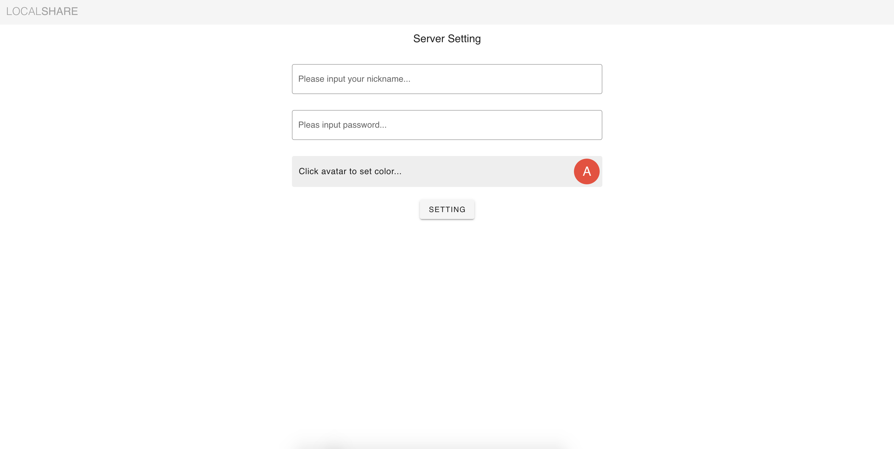
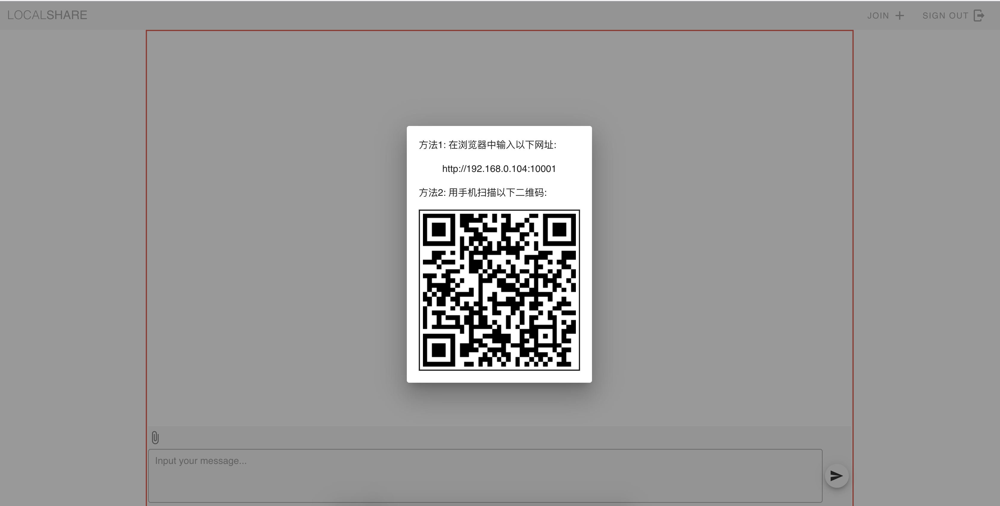
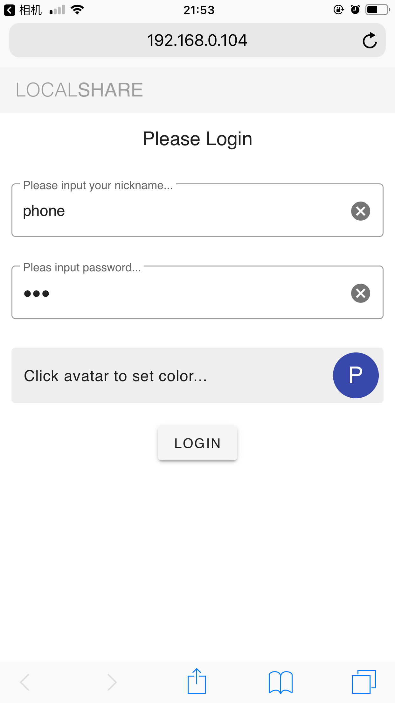
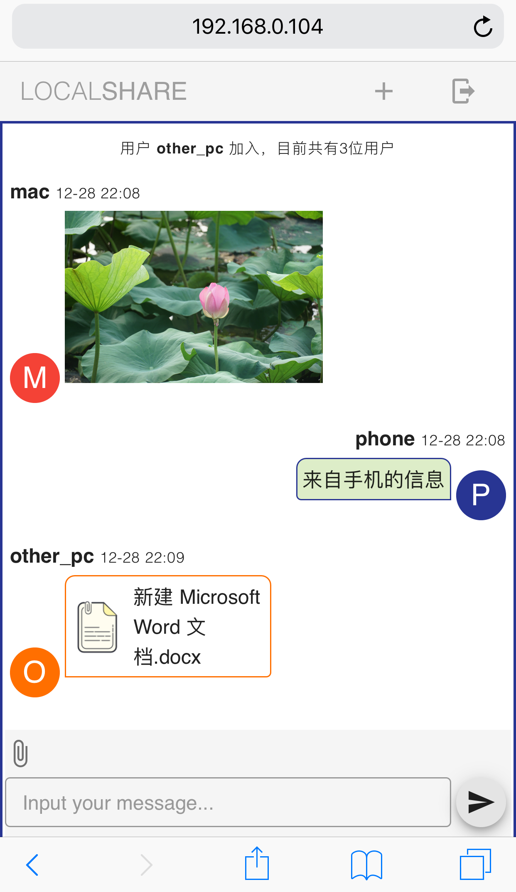

# local share

类似于web chat， 可以方便地在局域网内的多设备之间分享文字，图片和文件

功能：
- 除了服务器，其他设备无需下载，通过网页即可访问
- 通过密码访问，具备一定安全性
- 适配多种设备
- 支持图片，文件传送
- 可以自定义头像颜色

特性：
- 如果服务器退出，将会使其他客户端强制退出
- 服务器在没有连接的情况下，一个小时后会自动关闭

使用方法：
1. 在任何一个设备启动该软件
2. 在浏览器中输入http://127.0.0.1:10001, 端口号视占用情况，会递增
3. 点击加号，可以查看服务器的地址或二维码，以方便其他设备接入

主要技术：
- 前端使用 vue, vuetify 搭建
- 后端使用 express
- 通信使用 axios 和 socketio

## 编译步骤

### 安装依赖
```
npm install
```

### 编译项目
```
npm run build
```

### 启动 server
```
nodemon server.js
```

<!-- ### Lints and fixes files
```
npm run lint
``` -->


## TODO
- 显示在线用户列表

## 界面展示
server 设置界面


用于方便其他设备加入的二维码


设备登录界面


消息界面


